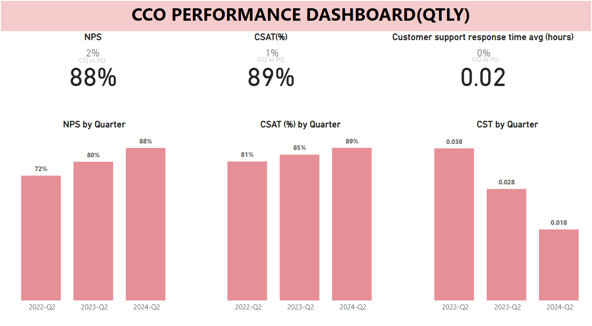

# CCO Dashboards:
The Chief Customer Officer (CCO) is a senior executive responsible for managing the overall relationship with customers and ensuring their satisfaction and loyalty. The CCO focuses on understanding customer needs, enhancing the customer experience, and driving customer-centric strategies across the organization. This role is pivotal in aligning company operations with customer expectations and fostering long-term customer relationships.

## CCO PBI Dashboard

# Key Metrics:

- Net Promoter Score (NPS)
- Customer Satisfaction (CSAT)
- Customer Effort Score (CES)
- Customer Retention Rate
- Churn Rate
- Customer Lifetime Value (CLTV or LTV)
- First Contact Resolution (FCR)
- Average Resolution Time
- Customer Health Score
- Upsell/Cross-Sell Rates

