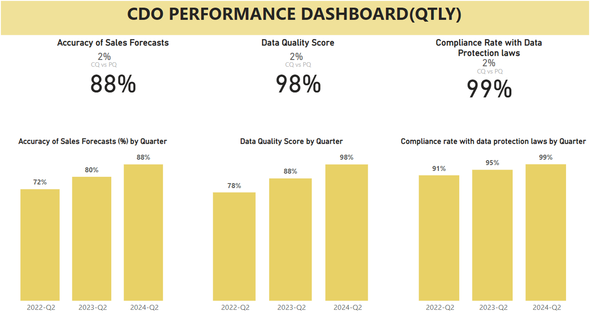

# CDO Dashboards:

CDO (Chief Data Officer) plays a critical role in managing an organization's data assets, ensuring data quality, governance, and leveraging data-driven insights for strategic decision-making. Key metrics for assessing the effectiveness of CDO initiatives typically revolve around data quality, data governance, data utilization, and business impact.

## CDO PBI Dashboard

# Key Metrics:
1. Data Quality Metrics:

- Data Accuracy: Measures the correctness and precision of data.

Example: Percentage of data records with accuracy issues identified through data profiling.

- Data Completeness: Measures the extent to which data is complete and lacks missing values.

Example: Completeness score (%) of key data fields compared to the total expected records.

- Data Consistency: Measures the uniformity and coherence of data across different systems and sources.

Example: Percentage of data records with inconsistent values across systems.

- Data Timeliness: Measures the currency and freshness of data.

Example: Average time taken to update or refresh critical data sets.

2. Data Governance Metrics:

- Data Policy Compliance: Measures adherence to data governance policies and regulations.

Example: Percentage of data assets compliant with regulatory requirements (e.g., GDPR, HIPAA).

- Data Access Control: Measures the effectiveness of access controls and permissions.

Example: Number of unauthorized data access attempts detected and prevented.

- Data Quality Incident Resolution Time: Measures the speed and efficiency of resolving data quality issues.

Example: Average time taken to address data quality incidents from detection to resolution.

3. Data Utilization Metrics:

- Data Usage Volume: Measures the volume of data consumed or accessed by users.

Example: Number of data queries or reports executed by business users per month.

- Data Utilization Rate: Measures the percentage of available data assets actively used for decision-making.

Example: Percentage of data assets accessed or utilized by business users compared to the total available data.

- Data-driven Insights: Measures the impact of data analytics and insights on business outcomes.

Example: Revenue increase attributed to data-driven decisions or insights.

4. Business Impact Metrics:

- ROI of Data Initiatives: Measures the return on investment from data-related projects and initiatives.

Example: ROI of implementing a data analytics platform or data governance framework.

- Cost Savings: Measures cost reductions or efficiencies achieved through improved data management.

Example: Reduction in data storage costs achieved through data archiving and optimization.

- Data-driven Innovation: Measures the contribution of data-driven innovation to business growth and competitiveness.

Example: Number of new products or services launched based on data-driven insights.

5. Data Security Metrics:

- Data Breach Incidents: Measures the frequency and severity of data security breaches.

Example: Number of data breaches reported per quarter and their impact on sensitive data.

- Data Encryption Coverage: Measures the percentage of sensitive data encrypted for protection.

Example: Percentage of sensitive data fields encrypted in databases and storage systems.

- Security Audit Findings: Measures compliance with data security standards and regulations.

Example: Number of security audit findings and their resolution status.

