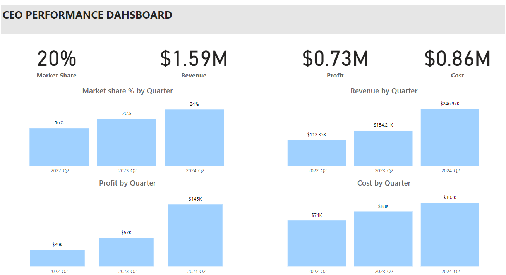

# CEO Dashboards:
CEO dashboards are critical tools for senior executives because they provide a high-level overview of key performance indicators (KPIs) and metrics that are essential for strategic decision-making and organizational management. 

## CEO PBI Dashboard

### 6 thinking hats:

1. **White Hat (Facts and Information):** Your dashboard shows how much money the company is making, how much it's spending, and how happy customers and employees are.

2. **Red Hat (Emotions and Feelings):** When revenue goes up, it means the company is doing well and everyone is happy. But if costs are high or customers aren't satisfied, people might feel worried or stressed.

3. **Yellow Hat (Optimism and Positivity):** Increasing revenue and market share are like scoring points in a game, making everyone excited. When employees are engaged and customers are happy, it's a win-win for the company.

4. **Black Hat (Caution and Critical Thinking):** High costs can eat into profits, so it's important to keep an eye on them. If revenue or market share drops, it could be a sign that something needs fixing.

5. **Green Hat (Creativity and Ideas):** To boost revenue, maybe we could launch new products or expand into new markets. To reduce costs, we could find more efficient ways of doing things.

6. **Blue Hat (Overview and Organization):** Let's look at the big picture – how are we doing overall in achieving our goals of making more money, cutting costs, and keeping everyone happy? This dashboard helps us see where we're doing well and where we need to improve.

### The metrics needed by the CEO serve several crucial purposes:

1. **Strategic Decision Making:** They provide essential data for strategic planning and decision-making, allowing the CEO to steer the company in the right direction.

2. **Performance Evaluation:** These metrics act as benchmarks to assess the company's performance over time, helping the CEO understand where the company stands relative to its goals and competitors.

3. **Alignment of Objectives:** By focusing on key areas such as revenue growth, cost reduction, employee engagement, and customer satisfaction, these metrics ensure alignment with the company's overarching goals and values.

4. **Communication and Accountability:** They facilitate clear communication of priorities and expectations throughout the organization, fostering accountability at all levels.

5. **Continuous Improvement:** Regularly tracking these metrics enables the CEO to identify areas for improvement and implement necessary changes to drive organizational growth and success.

### Obtaining this information on a regular basis can vary in difficulty depending on several factors to CEO:

1. **Data Availability:** If the necessary data is readily available and well-organized within the company's systems, it can be relatively straightforward for the CEO to access it regularly. However, if the data is scattered across different platforms or requires manual collection and compilation, it can be more challenging.

2. **Data Quality:** Ensuring the accuracy and reliability of the data is crucial. If data quality issues exist, such as inconsistencies or inaccuracies, it can hinder the CEO's ability to make informed decisions based on the metrics.

3. **Reporting Processes:** The efficiency of the reporting processes within the organization plays a significant role. If there are streamlined processes in place for collecting, analyzing, and presenting the data in a timely manner, it can make it easier for the CEO to access the information regularly.

4. **Technology and Tools:** Utilizing appropriate technology and tools, such as data analytics platforms or dashboard software, can greatly facilitate the process of gathering and monitoring key metrics for the CEO.

5. **Organizational Structure:** The complexity of the organization's structure and the availability of centralized data systems can impact the ease of access to information for the CEO. In some cases, decentralized or siloed data structures may present challenges in obtaining a holistic view of the company's performance.

Overall, while obtaining this information on a regular basis may require effort and effective processes, investing in robust data systems and reporting mechanisms can significantly facilitate the CEO's access to essential metrics for decision-making.
