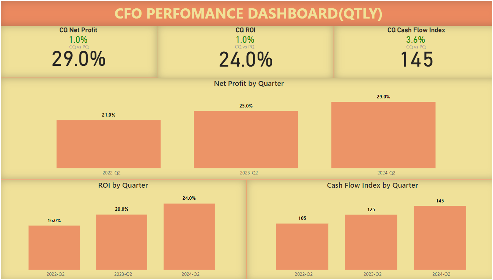

# CFO Dashboards:
The CFO Dashboard is a robust tool designed to provide Chief Financial Officers (CFOs) with a comprehensive, real-time view of the company's financial health. This dashboard aggregates key financial metrics and visualizes them to facilitate informed decision-making, strategic planning, and efficient financial management.. 

## CFO PBI Dashboard

### Key Metrics
Revenue and Revenue Growth
Net Profit and Profit Margins
Cash Flow Analysis
Operating Expenses
Cost of Goods Sold (COGS)
Debt-to-Equity Ratio
Return on Assets (ROA) and Return on Equity (ROE)

I have taken only few to calculate.