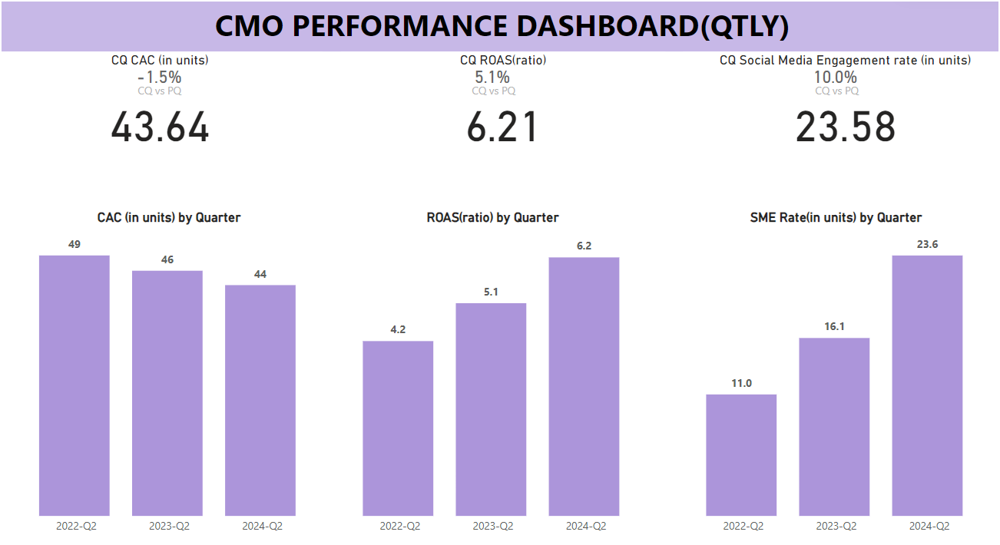

# CMO Dashboards:
The CMO Dashboard is a powerful tool designed to provide Chief Marketing Officers (CMOs) with real-time insights into marketing performance and customer engagement. This dashboard aggregates key marketing metrics and visualizes them to facilitate data-driven decision-making and strategic planning.

# Key Metrics:
- Customer Acquisition Cost (CAC)
- Customer Lifetime Value (CLV)
- Marketing ROI
- Conversion Rates
- Lead Generation and Conversion Rates
- Campaign Performance (click-through rates, engagement rates)
- Brand Awareness and Market Penetration
- Social Media Metrics (likes, shares, comments)

## CMO PBI Dashboard

