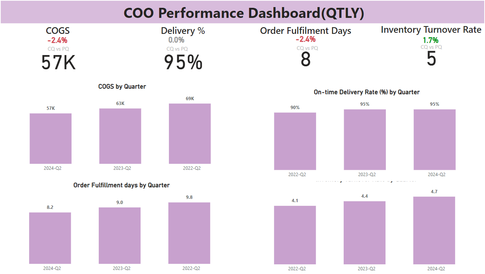

# COO Dashboards:
The Chief Operating Officer (COO) is a senior executive responsible for overseeing the day-to-day administrative and operational functions of a company. The COO typically reports directly to the Chief Executive Officer (CEO) and is often considered the second in command within the company. The role of a COO can vary significantly depending on the organization and its need.

# Key Metrics:
- Operational Efficiency
- Financial Performance
- Customer Satisfaction
- Employee Performance
- Quality and Compliance
- Project Management
- Innovation and Development

## COO PBI Dashboard

