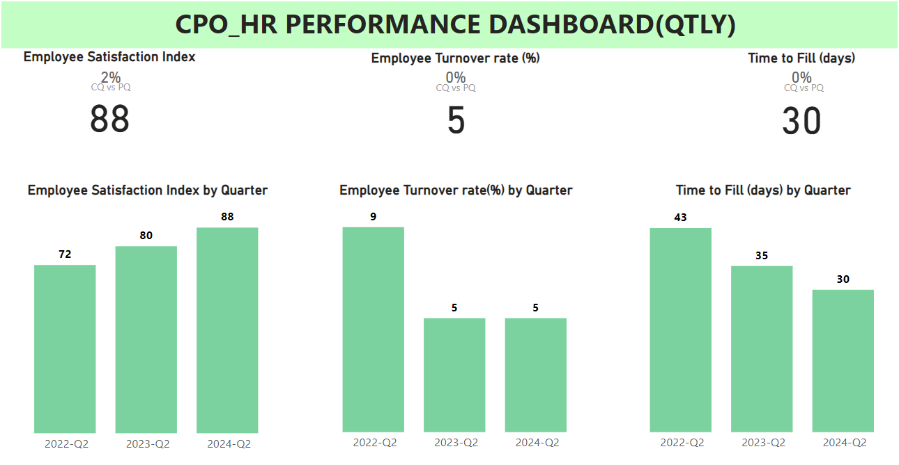

# CPO_HR Dashboards:
The Chief People Officer (CPO), also known as the Chief Human Resources Officer (CHRO), is a senior executive responsible for managing and overseeing all aspects of an organization's human resources (HR) functions. The CPO plays a crucial role in shaping the company culture, developing HR strategies, and ensuring the well-being and development of employees.

## CPO_HR PBI Dashboard

# Key Responsibilities of a CPO:

- Talent Acquisition: Oversee recruitment processes to attract, hire, and retain top talent.

- Employee Engagement: Develop and implement strategies to enhance employee engagement and satisfaction.

- Performance Management: Establish and manage performance appraisal systems to ensure effective employee performance and development.

- Learning and Development: Create training and development programs to enhance employee skills and career growth.

- Compensation and Benefits: Design and manage competitive compensation and benefits packages.

-Diversity and Inclusion: Promote diversity, equity, and inclusion within the workplace.
- Employee Relations: Manage employee relations and resolve workplace conflicts and issues.

- HR Compliance: Ensure compliance with labor laws and regulations.

- HR Analytics: Use data and analytics to drive HR strategies and decision-making.

- Culture and Values: Foster a positive company culture aligned with the organization's values and mission.

# Key Metrics:

- Employee Turnover Rate
- Employee Retention Rate
- Time to Fill
- Time to Hire
- Employee Engagement Score
- Training and Development Participation Rate
- Internal Mobility Rate
- Diversity and Inclusion Metrics
- Employee Net Promoter Score
- Absenteeism Rate
- Compensation Competitiveness
- HR-to-Employee Ratio

