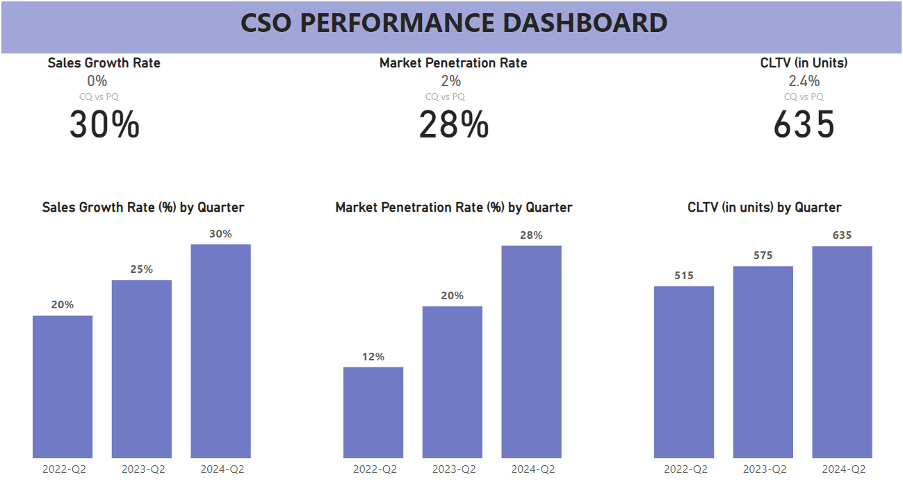

# CSO Dashboards:
The Chief Sales Officer (CSO) is a senior executive responsible for overseeing and directing a company's sales operations. The CSO plays a critical role in driving revenue growth, developing and implementing sales strategies, and ensuring that sales targets are met. They often work closely with other senior executives, such as the CEO and CMO, to align sales strategies with the overall business goals.

A CSO (Chief Sales Officer) Dashboard is a powerful tool designed to provide comprehensive insights into a company’s sales performance. It helps the CSO and the sales team monitor key sales metrics, track progress towards targets, and make data-driven decisions to optimize sales strategies.

## CSO PBI Dashboard

# Key Metrics:
-Total Sales Revenue
- Sales Growth Rate
- Sales Target Achievement
- Lead Conversion Rate
- Sales Cycle Length
- Average Deal Size
- Customer Acquisition Cost (CAC)
- Customer Lifetime Value (CLTV)
- Win Rate
- Sales by Region/Territory
