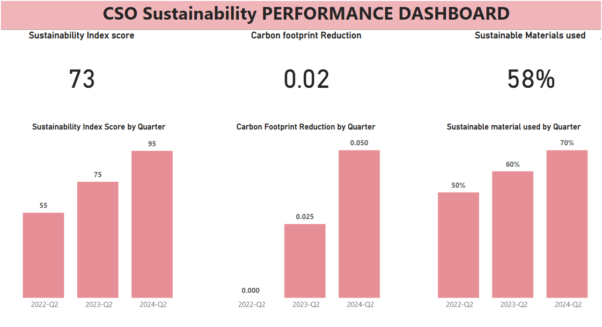

# CSO_Sustainability Dashboards:
The Chief Sustainability Officer (CSO) plays a crucial role in driving an organization's sustainability agenda. Sustainability metrics are used to measure and monitor the environmental, social, and economic impacts of an organization's operations. These metrics help assess the organization's progress towards sustainability goals and inform strategic decision-making.

## CSO_Sustainability PBI Dashboard

# Key Metrics:
- Environmental Impact:
Metrics related to resource usage, energy consumption, greenhouse gas emissions, waste generation, and water usage.

Example: Carbon footprint, water usage intensity.

- Social Impact:

Metrics related to employee well-being, community engagement, diversity and inclusion, labor practices, and human rights.

Example: Employee turnover rate, employee satisfaction index, community investment.

- Economic Impact:

Metrics related to financial performance, value creation, supply chain management, and stakeholder engagement.

Example: Return on Investment (ROI) for sustainability initiatives, economic value added.