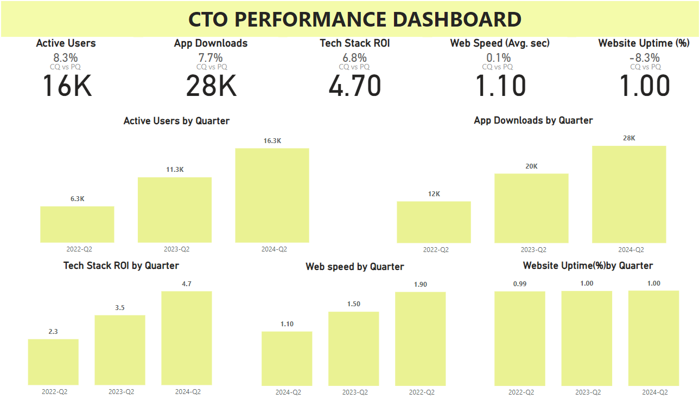

# CTO Dashboards:
The CTO Dashboard is a comprehensive tool designed to provide Chief Technology Officers (CTOs) with real-time insights into their organization's technology operations. It aggregates key metrics and visualizes them to facilitate data-driven decision-making, strategic planning, and efficient management of technology resources.

# Key Metrics:
- System Uptime and Downtime
- Server Load and Response Times
- Application Performance Metrics (APM)
- Error Rates and Incident Reports
- Code Quality Metrics (e.g., cyclomatic complexity, code coverage)
- Deployment Frequency and Lead Time
- Bug and Issue Resolution Times
- Security Incident Reports and Compliance Status
- Resource Utilization (CPU, Memory, Disk Usage)
- Project Progress and Sprint Metrics

## CTO PBI Dashboard

